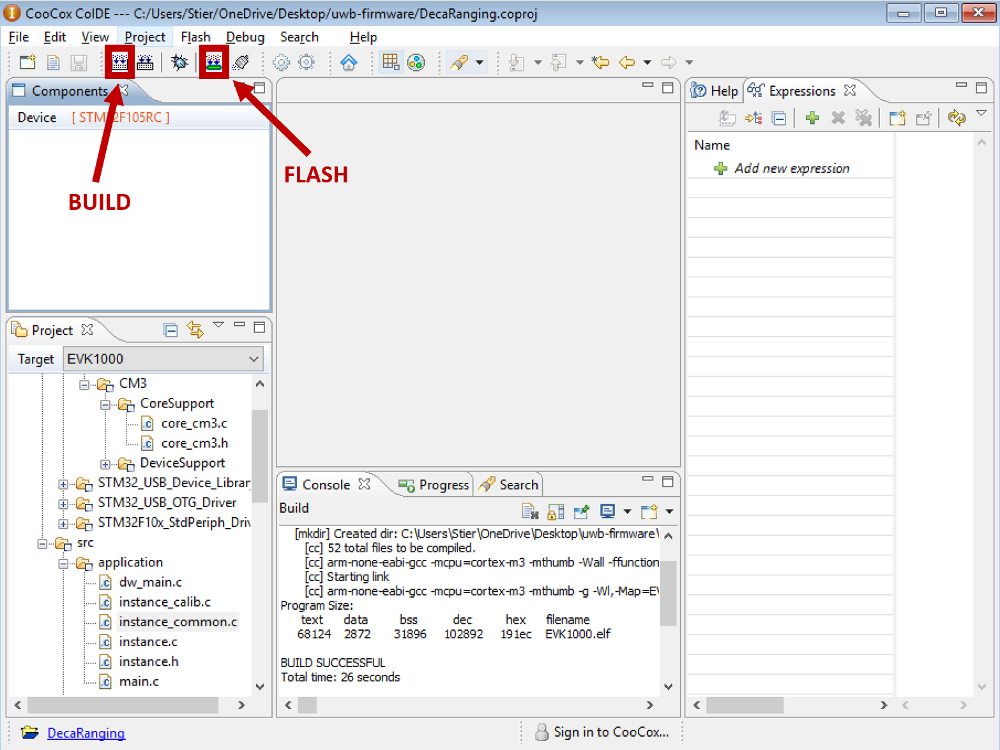

# Ultra WideBand Radio Firmware for Multi-Agent Ranging Applications

//TODO add a little more introductory explanation here...

This software is a modification of the firmware supplied by Decawave for their EVK1000 evaluation board. The new feature provided by this software is the ability for anchors to range with multiple tags and tags to range with multiple anchors. As much as possible of the original functionality has been preserved so most of the information provided in the EVK1000 User Manual still applies to this software 
<br/>
<br/>
The software and documentation for the EVK1000 evaluation kit and DW1000 transceiver can be found at the links below. The software and documentation can also be found in the [Decawave directory](Decawave).

[EVK1000 Product Page](https://www.decawave.com/product/evk1000-evaluation-kit/) <br/>
[Decawave Software Page](https://www.decawave.com/software/) <br/>
[Decawave Documentation Page](https://www.decawave.com/product-documentation/) <br/>

## Getting Started

//TODO add a table of contents...


### UWB Configuration

The EVB1000 allows for a numer of operational configurations via microswitches and jumpers. For default operations, ensure the EVB1000 is configured as shown in the images below. Consult the EVK1000 documentation for more configuration options.

**_NOTE:_** The device's role as either a TAG or ANCHOR is selected by SW4 of S1.


### Flashing the Binary

To flash the EVK1000, first connect the ST-LINK/V2 to the 20 pin JTAG connector (J4) with the connector tab aligned with the white silkscreen marking (facing away from the center of the board). Connect the ST-LINK/V2 to your computer USB. 

**_NOTE:_** The ST-LINK/V2 may not properly connect to the ST-LINK Utility software if connected to a USB hub. 


Next open the ST-LINK Utility. Click the *Program verify* button, then *Browse* in the window that pops up. Navigate to and select the firmware file and press *Start*. 
<br/>
<br/>
A compiled copy of the firmware (EVK1000.bin) can be found in the root directory of this repository. The STM32 ST-Link Utility can be downloaded from the [ST Link Utility Software Page](https://www.st.com/content/st_com/en/products/development-tools/software-development-tools/stm32-software-development-tools/stm32-programmers/stsw-link004.html#get-software) and is also included in this repository in the [STLINK directory](STLINK).
 


### Building from Source

To build the software from the source code, open the [DecaRanging.coproj file](DecaRanging.coproj) file with CoIDE. Download and install the [GNU Tools ARM Embedded 6-2017-q2-update](https://developer.arm.com/tools-and-software/open-source-software/developer-tools/gnu-toolchain/gnu-rm/downloads), click *Project* in the top menu, and click *Select Toolchain Path* from the dropdown. Click *Browse* in the window that pops up and navigate to and select the *GNU Tools Arm Embedded\6 2017-q2-update\bin* directory.


Then simply click the *Build* button and the EVK1000/Debug/bin/ directory will be created and the compiled binary will be placed inside. The binary can then be flashed according to [Flashing the Binary](#flashing-the-binary) or by pressing the *Download Code to Flash* button in CoIDE.



### Interfacing with the iBQR

tx2-ros-examples
The `uwb_interface` ROS package for interfacing with UWB can be found in the `tx2-ros-examples` repository. It is run using the following:

```
rosrun uwb_interface uwb_interface_node -p /dev/ttyAMC0
```

**_NOTE:_** Roscore must be running first. 
**_NOTE:_** The argument after `-p` is the path to the USB port connection and may not be the same as listed above. See the `tx2-ros-examples` repository for more information.

### EVB1000 Display

In order to save power, the LCD display is disabled by default. It can be reenabled by changing `#define USING_LCD (0)` to `#define USING_LCD (1)` in [src/application/instance.h](src/application/instance.h). When enabled, the LCD will display the range calculated and the address of the TAG/ANCHOR that it ranged with.

### Calibration

The ranging algorithm depends on RX and TX timestamps to accurately determine the time-of-flight (from which UWB distance can be derived) of the communications signals. For the derived distance calculations to be accurate, the signal propogation time from the antenna to the DW1000 transceiver (RX delay) and from the DW1000 to the antenna (TX delay) must be accounted for. By programming the RX and TX delays to the DW1000 OTP memory, the DW1000 will provide corrected timestamps to the ranging firmware. 

**_NOTE:_** Step-by-step instructions for performing the RX and TX delay calibration can be found in the uwb_delay_calibration package of the tx2-ros-examples repository.

**_NOTE:_** The range measurements depend on the speed of light through air. For best results, recalibrate the UWBs using the air conditions expected for the intended operating environment.


